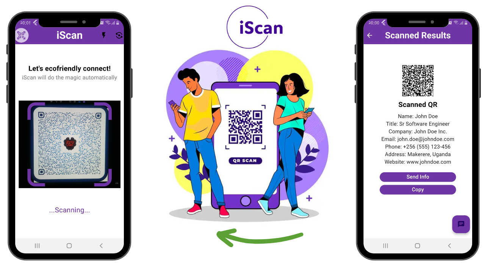
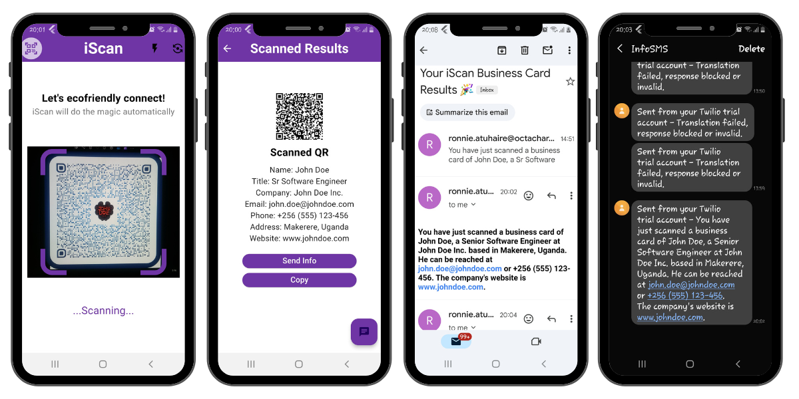

# iScan : Smart Eco-friendly connection 🎉...

iScan is a Flutter mobile application designed to simplify business-card management using QR codes, AI, and Twilio services for instant communication. The app is not yet hosted on the Play store or App Store. The front-end is entirely being developed from Flutlab and Python Flask for the API hosted on Render.

📌 Note: Mobile Flutter Source Code is Private; Available on request: But you can try my early version [here](https://tinyurl.com/ym9w4x56). (It is currently hard-coded to send to my phone & email)

## Overview

In today's digital age, traditional printed business cards contribute significantly to our carbon footprint and can be easily lost or misplaced. iScan addresses these challenges by allowing users to scan QR codes from business cards, extract relevant information, post the data to a flas API, then summarize it using Gemini API (RAG) Generative AI, and instantly receive the details via Twilio SMS or SendGrid email. This eliminates the need for physical cards and ensures that valuable connections are never lost.

## Features

- **QR Code Scanning**: Scan QR codes from business cards or any QR-enabled material.
- **AI-powered Summarization**: Utilize Gemini API (RAG) Generative AI to summarize extracted information into concise details.
- **Twilio Integration**: Send extracted information via SMS using Twilio's SMS service.
- **SendGrid Integration**: Send detailed information via email using SendGrid's email service.
- **Eco-friendly Solution**: Reduce carbon footprint by minimizing the use of printed business cards.
- **Cross-platform**: Built with Flutter, ensuring compatibility across Android and iOS devices.
- **Great UI**: Selfie mode is included and Flash Light is to handle Uganda's continuous blackouts 😂 and night events.

## Usage

1. Open the iScan app on your mobile device.
2. Use the QR code scanner to scan a QR code from a business card or any QR-enabled material.
3. User can copy the information or send it to himself (If No Internet!).
4. Wait for the app to extract and summarize the information using AI.
5. Receive the summarized details instantly via SMS or email.

## Contributing

Contributions are welcome! If you have suggestions, feature requests, or bug reports, please open an issue or submit a pull request.

## Future Implementations
The user will be able to signup with their information so that they receive these notification via sms and email; I hope to add the following soon.....

- [ ] **Instant Contact Saving**
- [ ] **Marketing Database Creation Using Text to SQL Generative Capability**
- [ ] **Sustainability and Eco-Friendliness**
- [ ] **Multi-Language Support**
- [ ] **Real-Time Notifications**
- [ ] **QR Code Placement Consultation**
- [ ] **Analytics Dashboard**
- [ ] **Customizable Templates**
- [ ] **Integration with Calendar Apps**
- [ ] **QR Code Creation via an API**

## Code Structure
The Main API Logic is `app.py` file handling all Twilio and Summarization with Generative AI (Gemini API). The web folder contains the website portfolio and the code for Flutter app is private currently.

- Visit Web: https://iscanweb.onrender.com/
- Visit Demo: https://tinyurl.com/2xd7dkhb

## License

This project is licensed under the MIT License - see the [LICENSE](LICENSE) file for details.

## Acknowledgments

- [Flutter](https://flutter.dev/) - For providing a framework for building cross-platform apps.
- [Flutlab](https://flutlab.io/) - Flutter Online IDE
- [Twilio](https://www.twilio.com/) - For enabling seamless SMS communication.
- [SendGrid](https://sendgrid.com/) - For facilitating reliable email delivery.
- [Google Generative AI](https://ai.google.dev/gemini-api/) - For providing advanced AI capabilities through Gemini API (RAG).
- [Flask - Python](https://flask.palletsprojects.com/) - Building the API
- [Render](https://render.com/) - Hosting the API

## Contact

For questions or inquiries about iScan, please contact [Your Name](mailto:ronlinx6@gmail,com).
